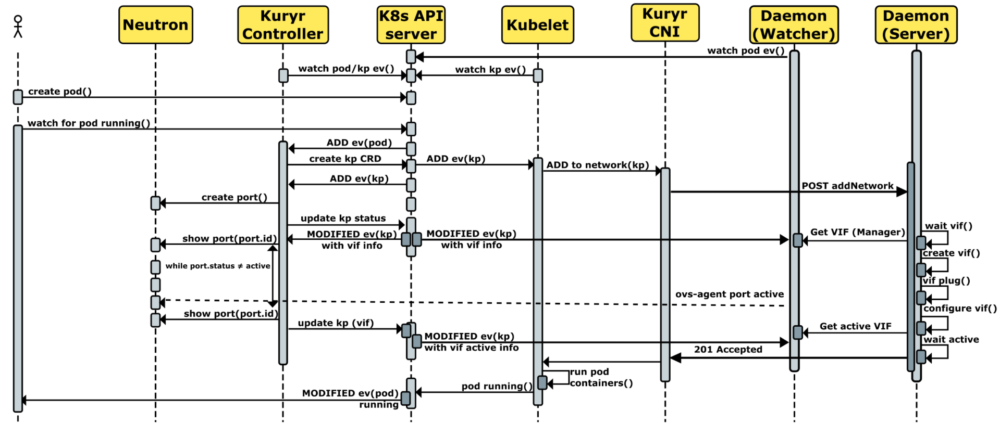
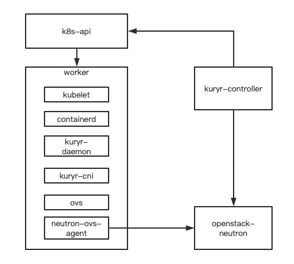
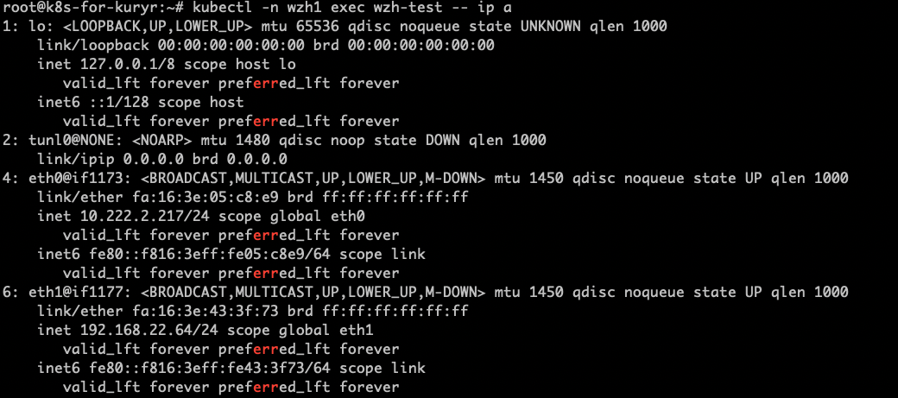

# Kuryr-Kubernetes
## 架构

kuryr-k8s设计的核心思路，将worker节点作为neutron-ovs-agent节点纳管进openstack，通过neutron调用kuryr-cni在ovs上创建对应vif，再将vif绑定到pod，这样pod与vm可以通过openstack的网络方式进行互相通信。

## 部署


kuryr-kurbernetes部署可以分为3个部分（kuryr-controller可以在和kubernetes-api/neutron通信的情况下，自由选择部署位置）
- worker
- openstack-neutron
- kuryr-controller

部署可以参考官方文档

[kuryr-k8s-install](https://docs.openstack.org/kuryr-kubernetes/latest/installation/manual.html)

### kuryr依赖：
1. kuryr-controller节点需要和k8s-api/neutron-server正常通信
2. kuryr-daemon(worker)节点需要安装ovs和neutron-ovs-agent被neutron纳管
3. kuryr对接k8s的service服务需要openstack loadbalance服务，kuryr-controller的prometheus进程会检测lb的endpoint
4. k8s需要创建kuryr相关crds，crd模板存放在kuryr-kubernetes/kubernetes_crds
```
root@k8s-for-kuryr:~# kubectl get crd
NAME                                             CREATED AT
kuryrloadbalancers.openstack.org                 2022-10-24T07:04:54Z
kuryrnetworkpolicies.openstack.org               2022-10-24T07:04:54Z
kuryrnetworks.openstack.org                      2022-10-24T07:04:54Z
kuryrports.openstack.org                         2022-10-24T07:04:54Z
network-attachment-definitions.k8s.cni.cncf.io   2022-10-28T08:57:19Z
```
5. kuryr对接k8s时如果不使用证书认证，可以选择token，k8s1.24版本以后，创建serviceaccount后不会再自动创建对应的secret,所以需要手动创建。
```
apiVersion: v1
kind: ServiceAccount
metadata:
  name: admin
  namespace: kube-system
---
kind: ClusterRoleBinding
apiVersion: rbac.authorization.k8s.io/v1
metadata:
  name: admin
subjects:
  - kind: ServiceAccount
    name: admin
    namespace: kube-system
roleRef:
  kind: ClusterRole
  name: cluster-admin
  apiGroup: rbac.authorization.k8s.io
---
apiVersion: v1
kind: Secret
type: kubernetes.io/service-account-token
metadata:
  name: admin
  namespace: kube-system
  annotations:
    kubernetes.io/service-account.name: "admin"
```
## kuryr多租户对接
kuryr可以通过annotation的方式对接openstack project与k8s ns，实现对租户的对接，kuryr创建ns会关联到对应的project，创建pod时会在公共的subnet pool中创建一个subnet到对应的project，将subnet链接到公共的router，再通过openstack security group与k8s policy的绑定来进行访问限制。

同时，kuryr也可以支持pod多端口挂载，可以将pod的第二个端口挂载在用户已经创建好的网络中。



官方对接文档:

[ns-network](https://docs.openstack.org/kuryr-kubernetes/latest/installation/network_namespace.html)

[sg-policy](https://docs.openstack.org/kuryr-kubernetes/latest/installation/network_policy.html)

[multi-tenants](https://docs.openstack.org/kuryr-kubernetes/latest/installation/multiple_tenants.html)

[add-interface](https://docs.openstack.org/kuryr-kubernetes/latest/installation/multi_vif_with_npwg_spec.html)

对接配置参考：
```
[kubernetes]
pod_project_driver = annotation
service_project_driver = annotation
namespace_project_driver = annotation
network_policy_project_driver = annotation
pod_subnets_driver = namespace
pod_security_groups_driver = policy
enabled_handlers = vif,endpoints,namespace,policy,kuryrnetwork,kuryrport,kuryrnetworkpolicy,kuryrloadbalancer,pod_label
multi_vif_drivers = npwg_multiple_interfaces

[namespace_subnet]
pod_router = 1a9ebf22-318b-4124-b49a-786299ba5bb9
pod_subnet_pool = 3bd76a73-59a9-4dc1-b2a4-aa8170a769c6
```

## 功能开发
- 支持多kuryrnetwork选择
- 支持多kuryrnetwork遍历调度
- 支持指定kuryrport ip地址