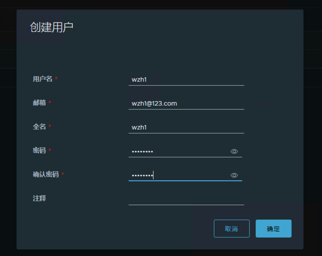
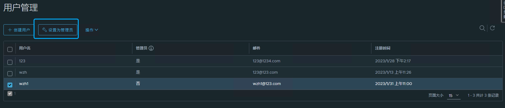

# 容器镜像服务部署

## Nydus部署

### 通过helm安装
```
$ helm repo add dragonfly https://dragonflyoss.github.io/helm-charts/
$ helm fetch dragonfly/nydus-snapshotter --untar
#修改好chart后自定义安装
$ helm -n nydus install -f values.yaml nydus ./
```

## Dragonfly部署

### 通过helm安装
```
$ helm repo add dragonfly https://dragonflyoss.github.io/helm-charts/
$ helm fetch dragonfly/dragonfly --untar
#修改好chart后自定义安装
$ helm -n dragonfly install -f values.yaml dragonfly ./
```

## Istio-gw配置

### 创建secret
```
$ kubectl -n istio-system create secret tls --cert=xxx.xxx.crt --key=xxx.xxx.key cloud-registry-cert
```

### 创建gw
```
apiVersion: networking.istio.io/v1alpha3
kind: Gateway
metadata:
  name: cloud-registry-gateway
  namespace: istio-system
  labels:
    kubernetes.io/metadata.name: cloud-registry-gateway
spec:
  selector:
    istio: ingressgateway
  servers:
  - port:
      number: 80
      name: http-port
      protocol: HTTP
    hosts:
    - "*.xxx.xxx.cn" #配置gw匹配域名
    tls:
      httpsRedirect: true
  - port:
      number: 443
      name: https-port
      protocol: HTTPS
    hosts:
    - "*.xxx.xxx.cn" #配置gw匹配域名
    tls:
      mode: SIMPLE
      credentialName: cloud-registry-cert
```

## 公共Harbor部署
与用户harbor部署过程相同，需要修改部分参数

## 用户Harbor部署

### 创建用户ns
```
$ kubectl create ns cus-xxx
```

### 通过helm安装
```
$ helm repo add crchart https://xxx.xxx.xxx.cn/chartrepo/cloud-registry-chart
$ helm fetch crchart/harbor --untar #将chart下载到本地进行自定义修改安装，可选
```

### 修改chart配置
根据需要修改chart，关闭nginx
```
nginx:
  replicas: 0
```

### 用户Harbor安装
```
#本地离线方式
$ helm install -n cus-xxx -f values.yaml cusxxx-harbor ./harbor
$ helm install -n cus-xxx --set key1=value1,key2=value2 cusxxx-harbor ./harbor
#在线repo方式
$ helm install -n cus-xxx -f values.yaml / --set key1=value1,key2=value2 cusxxx-harbor harbor/harbor
```

### 创建对应istio-vs
```
---
apiVersion: networking.istio.io/v1alpha3
kind: VirtualService
metadata:
  name: harbor-http-virtual-service
  namespace: cmp-global-harbor
spec:
  gateways:
    - istio-system/harbor-service-gateway
  hosts:
    - r21-harbor.xxx.xxx.cn
    - r21-harbor-internal.xxx.xxx.cn
    - r22-harbor.xxx.xxx.cn
    - r22-harbor-internal.xxx.xxx.cn
  http:
  - match:
    - uri:
        prefix: '/c/'
    rewrite:
      uri: '/c/'
    route:
      - destination:
          host: harbor-core
          port:
            number: 80
  - match:
    - uri:
        prefix: '/api/'
    rewrite:
      uri: '/api/'
    route:
      - destination:
          host: harbor-core
          port:
            number: 80
  - match:
    - uri:
        prefix: '/v2/'
    rewrite:
      uri: '/v2/'
    route:
      - destination:
          host: harbor-core
          port:
            number: 80
  - match:
    - uri:
        prefix: '/chartrepo/'
    rewrite:
      uri: '/chartrepo/'
    route:
      - destination:
          host: harbor-core
          port:
            number: 80
  - match:
    - uri:
        prefix: '/service/'
    rewrite:
      uri: '/service/'
    route:
      - destination:
          host: harbor-core
          port:
            number: 80
  - match:
    - uri:
        prefix: /
    rewrite:
      uri: /
    route:
    - destination:
        host: harbor-portal
        port:
          number: 80
```

### 创建对应istio-policy
```
apiVersion: v1
items:
- apiVersion: security.istio.io/v1beta1
  kind: AuthorizationPolicy
  metadata:
    name: ingress-policy
    namespace: istio-system
  spec:
    action: ALLOW
    rules:
    - from:
      - source:
          ipBlocks:
          - 10.3.22.0/24
          - 10.3.18.0/24
          - 172.22.0.0/24
          - 189.189.0.1
    selector:
      matchLabels:
        app: istio-ingressgateway
kind: List
```

### 新建用户管理员



## 通过job调用helm安装
```
apiVersion: batch/v1
kind: Job
metadata:
  name: helm
  namespace: wzh-harbor-test
spec:
  ttlSecondsAfterFinished: 60
  template:
    spec:
      hostNetwork: true
      dnsPolicy: ClusterFirstWithHostNet
      containers:
      - name: helm-client
        image: xxx.xxx.xxx/cloud-registry/helm-client:v1
        command: ["/bin/bash","-c"]
        args:
          - helm repo add crchart https://xxx.xxx.xxx.cn/chartrepo/cloud-registry-chart;
            helm --kubeconfig /home/helm/config -n wzh-harbor-test install -f /home/helm/values.yaml harbor crchart/harbor
        volumeMounts:
        - mountPath: /home/helm
          name: helm
      volumes:
      - name: helm
        hostPath:
          path: /root/wzh/helm-config
          type: DirectoryOrCreate
      restartPolicy: Never
  backoffLimit: 1
```

## dragonfly添加用户认证(底层使用共享存储挂载配置路径，非共享可以使用OpenKruise的broadcastjob crd)
```
apiVersion: batch/v1
kind: Job
metadata:
  name: d7y-config
  namespace: wzh
spec:
  ttlSecondsAfterFinished: 30
  template:
    spec:
      restartPolicy: Never
      nodeSelector:
        cloud-registry: master
      containers:
      - name: d7y-config
        image: busybox:latest
        command:
        - /bin/sh
        - -cx
        - |-
          registry=wzh-harbor-internal.xxx.xxx.xxx
          d7y_proxy=http://127.0.0.1:65001
          conf_dir=/etc/containerd/certs.d
          mkdir -p "$conf_dir/${registry}"
          cat << EOF > "$conf_dir/${registry}"/hosts.toml
          server = "https://${registry}"
          [host."${d7y_proxy}"]
            capabilities = ["pull", "resolve"]
            [host."${d7y_proxy}".header]
              X-Dragonfly-Registry = ["https://${registry}"]
            [host."https://${registry}"]
              capabilities = ["pull", "resolve"]
          EOF
        volumeMounts:
        - mountPath: /etc/containerd/certs.d
          name: certs
      volumes:
      - name: certs
        hostPath:
          path: /etc/containerd/certs.d
          type: DirectoryOrCreate
  backoffLimit: 0
```