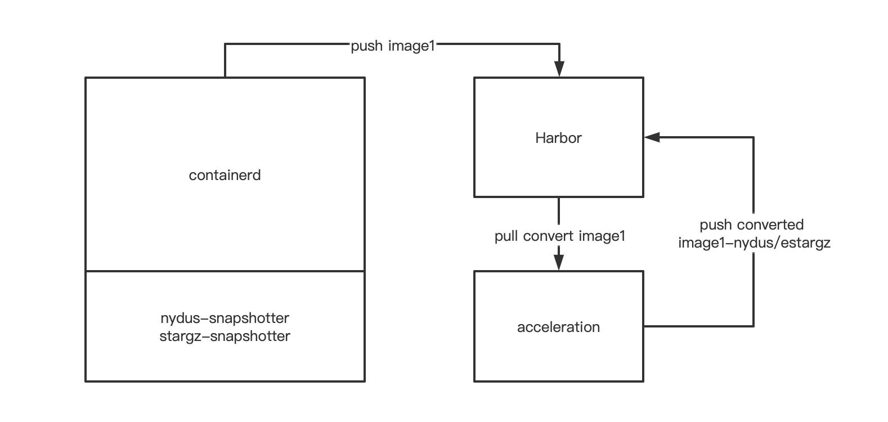
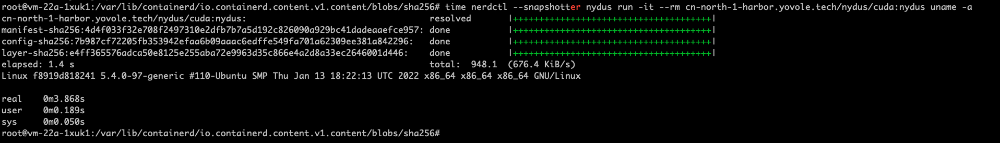
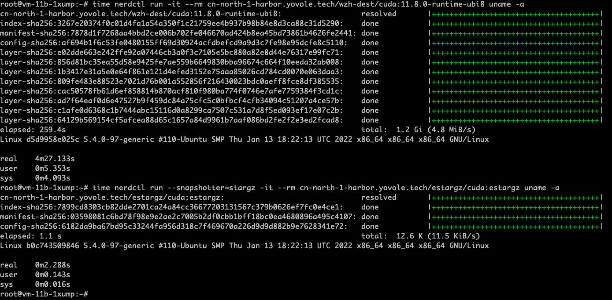
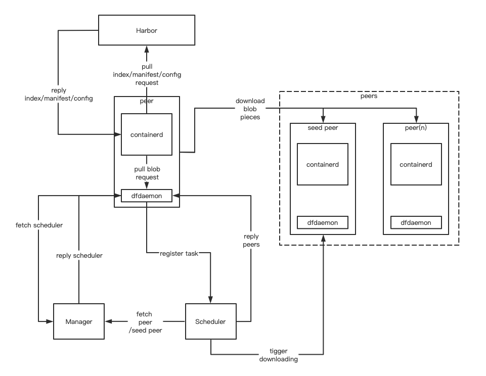
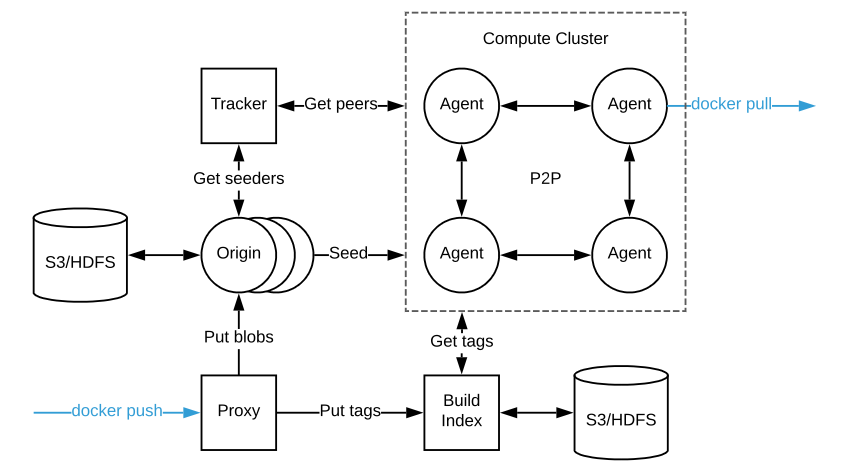
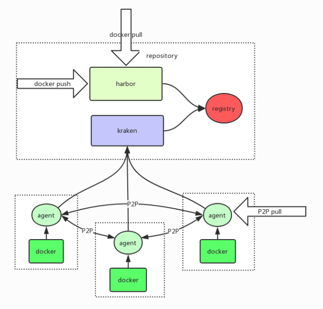

# 容器镜像加速服务

## 镜像按需加载(lazy-pulling)
容器启动时间过长主要时间浪费在pull镜像的过程，传统overlayfs格式的oci镜像，需要把所有层全部下载到本地后才能启动，解决这个问题的思路就是把镜像的层进行远程挂载，在需要进行数据读写时，再通过网络进行交互。

### 远程挂载读取的关键点在于：
1. 镜像层的数据可以进行检索读取
2. 容器运行时可以允许远程挂载启动容器。

### 对应关键点解决技术：
1. 可检索镜像格式：stargz/estargz(CRFS)，nydus(RAFS)
2. 容器远程挂载插件（remote snapshotter）：stargz-snapshotter，nydus-snapshotter

### stargz

正常的镜像层文件都是gzip文件，gzip文件是不可检索的，所以上图中的stargz格式的镜像文件，通过footer文件记录了TOC文件的偏移量，再通过TOC文件记录各层数据的偏移量，实现的层数据的索引，这样当远程挂载的时候就可以把对应层的数据挂载到本地对应的路径。

### estargz

estargz格式是对stargz进行的再次优化，由于远程挂在层后，数据的大部分交互都依赖网络，所以，estargz就把数据进行了优先级的分类，加入了landmark层，这样stargz-snapshotter可以通过dockerfile中的信息预加载优先级高的数据，减少网络数据交互的影响。

### stargz-snapshotter

snapshotter是containerd的一个plugin，主要功能是用来存储下载到本地的镜像的每一层数据，remote snapshotter则允许镜像层进行远程挂载，stargz-snapshotter就是remote snapshotter的一种。

### nydus(阿里)

nydus完全放弃了gzip的格式，把镜像格式拆分成元数据(bootstrap)和数据(blob)两部分，元数据是一个树形索引结构，数据是按照每块1M的大小进行存储。nydus同样拥有预加载特性。

### nydus-snapshotter
功能与stargz-snapshotter类似，负责container侧对rafs镜像格式的支持，同时支持crfs。

### Acceleration Service

nydus和estargz都是特殊的镜像格式，他们都支持从oci标准镜像进行转换。nydus使用nydusify，estargz可以使用nerdctl。nydusify和nerdcty都是客户端的镜像转换工具，镜像转换需要消耗大量cpu资源。

Acceleration服务则是把两种镜像转换的步骤，放到单独的服务中，可以通过harbor通过webhook进行push触发，这样就释放了客户端镜像转换的资源。当用户push普通的oci镜像时，通过webhook触发acceleration服务，acceleration根据配置文件进行特定格式的镜像转换，然后再推送到harbor。

### 容器启动时间对比
- nydus-legacy对比

- estargz-legacy对比

### 参考
[nydus](https://github.com/dragonflyoss/image-service)

[nydus-snapshotter](https://github.com/containerd/nydus-snapshotter)

[estargz](https://github.com/containerd/stargz-snapshotter/blob/main/docs/estargz.md)

[stargz-snapshotter](https://github.com/containerd/stargz-snapshotter)

---
## 镜像网络加速(P2P)
remote snapshotter方式解决了容器启动时拉取镜像慢的问题，但是当所有的节点都访问harbor时，harbor的网络则会成为瓶颈，依赖P2P的网络结构则可以解决这一瓶颈。

### Dragonfly(阿里)

使用dragonfly pull镜像流程

1. 新的peer节点containerd向harbor发起pull请求
2. harbor返回镜像索引文件
3. containerd根据索引文件请求blob文件
4. dfdaemon拦截blob请求，并向dragonfly manager节点寻找scheduler
5. dfdaemon接收返回的scheduler，向scheduler注册，并发送下载请求
6. scheduler接收请求后到manager请求peer节点信息
7. scheduler到peer节点确认下载数据信息
8. scheduler返回peer节点数据下载信息给dfdaemon
9. dfdaemon到对应peer节点下载数据pieces

### Kraken(Uber)

### 参考
[Dragonfly](https://d7y.io/zh/docs/)

[Dragonfly-github](https://github.com/dragonflyoss/Dragonfly2)

[Kraken](https://uber-kraken.readthedocs.io/en/latest/)

[Kraken-github](https://github.com/uber/kraken)