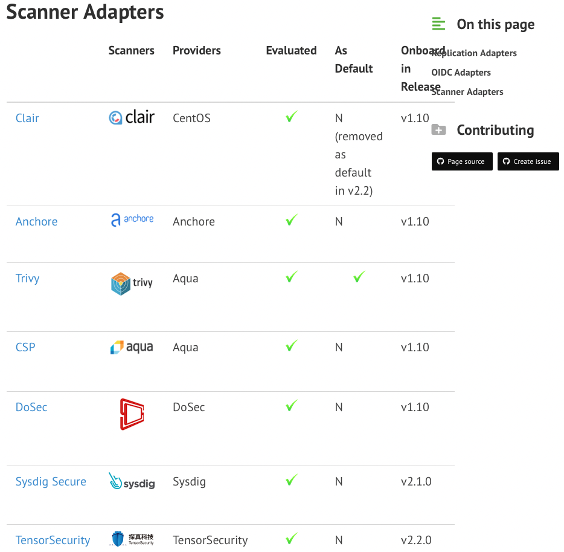
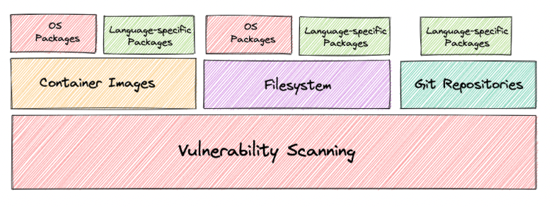

# 镜像扫描

目前harbor主流支持的镜像扫描工具有7个，默认的扫描工具为Trivy，harbor的部署脚本只支持trivy和clair的部署集成。

## Trivy

Trivy是Aqua开发的一款扫描工具，支持多种类型资源的漏洞扫描.

## harbor-scanner-trivy
用于harbor与trivy的集成，将harbor发送的api请求转换成trivy命令进行扫描。

## Clair

Clair是由quay开发的一款扫描工具，相比trivy出现更早，但是功能覆盖和检测覆盖不如trivy。

## harbor-scanner-Clair
用于harbor与clair的集成，将harbor发送的api请求转换成clair的api。

### 参考
[Trivy](https://aquasecurity.github.io/trivy/v0.32/)

[Trivy github](https://github.com/aquasecurity/trivy)

[Trivy harbor adapter](https://github.com/aquasecurity/harbor-scanner-trivy)

[Clair](https://quay.github.io/clair/)

[Clair harbor adapter](https://github.com/goharbor/harbor-scanner-clair)

[harbor scanner Adapters](https://goharbor.io/docs/2.3.0/install-config/harbor-compatibility-list/#scanner-adapters)